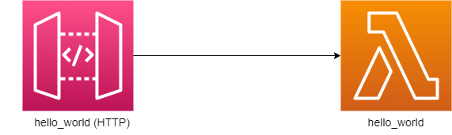

ℹ️ Si requieres apoyo para crear un proceso de CI/CD Serverless en tu organización o ya tienes uno pero es complicado administrar multiples repositorios. Tal vez podamos ayudarte:
- Escribir a nuestro Sandpy Chatbot https://spsolutions.com.mx/
- Levanta un sissue en este repositorio.

-----------------------

# Cookiecutter Github SAM API

Este proyecto es una plantilla que permite generar un proyecto "serverless" básico, que sirva como punto inicial a proyectos pequeños de un solo repositorio.

**Diagrama:**



**Tipo:** API

**Descripción:** 
Esta API permite presentar el mensaje "Hello World" en el path /hello

Si quieres pulir tus habilidades en AWS [puedes contribuir agregando más funcionalidades](#contribuciones).

**[Recuperación de desastres](https://aws.amazon.com/blogs/architecture/disaster-recovery-dr-architecture-on-aws-part-iii-pilot-light-and-warm-standby/)**:
- Categoría: Activo/Pasivo (Active/pasive)
- Estrategia: Espera caliente (Warm standby) 

**Servicios:**
- [AWS API Gateway (HTTP)](https://docs.aws.amazon.com/apigateway/latest/developerguide/http-api.html)
- [AWS Lambda](https://docs.aws.amazon.com/es_es/lambda/latest/dg/welcome.html)
- [AWS CloudFormation](https://docs.aws.amazon.com/AWSCloudFormation/latest/UserGuide/Welcome.html)

**Herramientas:**
- [Cookiecutter 2.1.1](https://cookiecutter.readthedocs.io/en/2.1.1/)
- [AWS SAM ](https://docs.aws.amazon.com/serverless-application-model/latest/developerguide/serverless-sam-cli-install.html)
- [Git](https://git-scm.com/book/en/v2/Getting-Started-Installing-Git)

**Crear proyecto:** [Cookiecutter](#cookiecutter)

------------------------------------------------------------------------------------------------------------

## Índice
1. [AWS y Serverless](#aws-y-serverless)
  - [CloudFormation](#cloudformation)
  - [SAM](#sam)
2. [Github y Github Actions](#github-y-github-actions)
3. [Cookiecutter](#cookiecutter)
4. [Contribuciones](#contribuciones)


## AWS y Serverless
AWS tiene varios servicios administrados que se cobran por uso, los más comunes: colas de mensajes, bus de eventos, administración de APIs, orquestación de servicios y envío de notificaciones. No es necesario instalar un producto en un servidor y mantenerlo actualizado, AWS se encarga de estas tareas y así nos concentramos en elegir la mejor herramienta para nuestro caso de uso.

También permite ejecutar código sin necesidad de un servidor dedicado: al recibir un evento que cumple ciertas condiciones AWS crea una instancia que ejecuta nuestro código, según la demanda puede crear más instancias. El cobro es por el tiempo que duró la ejecución del código y el número de instancias creadas. 

Se pueden diseñar soluciones completas utilizando estas herramientas y a este tipo de aplicaciones se les conoce como "serverless" (sin servidor). 

https://aws.amazon.com/serverless/

## CloudFormation
Es posible habilitar y configurar todos estos servicios de distintas maneras:
- [Consola web](https://console.aws.amazon.com)
- [CLI](https://aws.amazon.com/cli/)
- [APIs](https://docs.aws.amazon.com/)
- [SDKs](https://aws.amazon.com/developer/tools/)

Todas son útiles en distintos escenarios pero AWS ha creado otro servicio que permite tener estas definiciones en archivos de texto (YAML o JSON) que pueden ser agregados a un repositorio de código como este y utilizarlo para crear y modificar recursos en AWS. De esta manera se puede tener una trazabilidad sobre los cambios que se han realizado en un sistema, colaborar y realizar modificaciones modificando esta definición (infraestructura como código).


_¿Cómo funciona CloudFormation?: https://docs.aws.amazon.com/AWSCloudFormation/latest/UserGuide/cfn-whatis-howdoesitwork.html_


### SAM

#### SAM template specification 

Las plantillas de CloudFormation pueden crecer rápidamente y definir todos los recursos de una aplicación puede ser una tarea repetitiva y tardada, para solucionar esto AWS ha creado un framework que permite definir la mayoría de recursos de una aplicación "serverless" de una forma simple y con menos líneas. 


_Especificación de plantilas SAM: https://docs.aws.amazon.com/serverless-application-model/latest/developerguide/sam-specification.html_

Estas definiciones cortas soportan la mayoría de servicios utilizados en una aplicación "serverless" como:

-   [AWS::Serverless::Api](https://docs.aws.amazon.com/serverless-application-model/latest/developerguide/sam-resource-api.html)
Crea una función lambda que recibe peticiones a traves del API Gateway, permite agregar un documento de OpenAPI para la configuración del API REST. [Comparación entre API REST y HTTP API](https://docs.aws.amazon.com/apigateway/latest/developerguide/http-api-vs-rest.html)

-   [AWS::Serverless::Function](https://docs.aws.amazon.com/serverless-application-model/latest/developerguide/sam-resource-function.html)
Crea una función lambda y un rol de IAM asociado a ella. La función puede ser iniciada por distintos eventos (S3 | SNS | Kinesis | DynamoDB | SQS | Api | Schedule | CloudWatchEvent | EventBridgeRule | CloudWatchLogs | IoTRule | AlexaSkill)

-   [AWS::Serverless::HttpApi](https://docs.aws.amazon.com/serverless-application-model/latest/developerguide/sam-resource-httpapi.html)
Crea una función lambda que recibe peticiones a traves del API Gateway. [Comparación entre API REST y HTTP API](https://docs.aws.amazon.com/apigateway/latest/developerguide/http-api-vs-rest.html)

-   [AWS::Serverless::LayerVersion](https://docs.aws.amazon.com/serverless-application-model/latest/developerguide/sam-resource-layerversion.html)
Si multiples funciones requieren las mismas librerías es posible crear una capa reutilizables que incluya estas librerías.

-   [AWS::Serverless::SimpleTable](https://docs.aws.amazon.com/serverless-application-model/latest/developerguide/sam-resource-simpletable.html)
Permite crear tablas de DynamoDB.

-   [AWS::Serverless::StateMachine](https://docs.aws.amazon.com/serverless-application-model/latest/developerguide/sam-resource-statemachine.html)
SAM también tiene soporte para agregar a tu proyecto Step Functions y orquestar distintas lambdas o incluso otros servicios de AWS.

#### SAM command line interface

SAM también ofrece un CLI que permite inicializar proyectos basados en plantillas, construir y desplegar una plantilla de SAM, crear eventos de pruebas, ejecutar localmente el proyecto y obtener logs los componentes luego de desplegados en AWS.


_Inciando con el CLI de SAM_: https://www.sqlshack.com/getting-started-with-the-aws-sam-cli/

Para mayor información de comandos de CLI de SAM: [AWS SAM CLI command reference - AWS Serverless Application Model](https://docs.aws.amazon.com/serverless-application-model/latest/developerguide/serverless-sam-cli-command-reference.html)


## Github y Github Actions

Github inicio como una plataforma para subir repositorios de código basados en Git, con el tiempo ha ido agregando más funcionalidades al punto de volverse una plataforma para administrar todo el ciclo de vida de una aplicación:
- Control de versiones (Github Repositories)
- Colaboración (Pull request y Forks)
- Marcar liberaciones (Releases)
- Repositorio de artefactos (Github Packages)
- Administración de proyectos (Github Projects)
- Automatización de la construcción y despliegue (Github Actions)
- Automatización de tareas dentro de Github (Github Actions)
- Escaneo de vulnerabilidas
- Estadisticas de uso

### Ramas (Explicación de trunk based development)

Todo repositorio de código debe tener definidas algunas reglas para trabajar y colaborar. Trunk base development es la estrategia que mejor nos ha funcionado pues reduce la cantidad de conflicto al reducir la cantidad de "merges" o "pull requests":


_Trunk based development:_ https://trunkbaseddevelopment.com/

#### main

La rama _main_ es la rama principal (trunk en el diagrama) todo el código se sube directamente ahí, si se agrego un nuevo desarrollador que aún no está familiarizado con el código se puede solicitar que introduzca sus cambios mediante "pull request" para que sean revisados por su mentor o guía en el proyecto, eventualmente podrá introducir cambios directamente en _main_.

#### releases/x.x.x

Una vez que se libera el código a producción se genera una rama de release, estas ramas están protegidas (ya no se pueden modificar) y deben utilizar [versionado semántico](https://semver.org/lang/es/) para indicar la versión.

_Ejemplo: releases/1.0.0_

#### fix/x.x.x

> Recuerda que las ramas releases/x.x.x están protegidas.

En caso de que ocurra un bug en producción, hay dos posibles caminos:

1. Si en main no se han introducido nuevos cambios al código, el fix se deberá realizar directamente en main y al generar un nuevo release se incrementará la versión parche.
  - _Ejemplo: 1.0.0 -> 1.0.1_
2. Si el código en main ya cambio porque se está trabajando en una nueva funcionalidad, este código aún no está listo para enviarse a producción así que no podemos realizar el fix sobre main. En estos casos se crea una rama fix con la versión de parche incrementada a partir de la rama release que queremos corregir. Una vez arreglado el código se despliega en producción y se crea una nueva rama releases.
  - _Ejemplo: releases/1.0.0 -> fix/releases/1.0.1 -> releases/1.0.1_


### Github Workflows (Como los workflows en el repo permiten seguir la estrategia de ramas y desplegar con algunos clics)


Workflow reusables (Como los workflows hacen llamados a los workflows reusables para completar tareas y liga a la administración de workflows)

> Nota: Si el proyecto crece y se crean multiples repositorios, se debe crear un repo independiente en el que puedan guardarse los workflows reusables y otras utilerías

## Cookiecutter

Cookiecutter es un manejador de plantillas multiplataforma que permite crear plantillas en lenguajes de programación o formato de marcado. Puede utilizarse como herramienta de la linea de comandos o como librería de Python. 

## Prerequisitos:
Contar con las siguientes herramientas instaladas:
   - [Python](https://www.python.org/downloads/release/python-3913/)
   - [Cookiecutter](https://cookiecutter.readthedocs.io/en/stable/installation.html)
   - [Git](https://git-scm.com/downloads)
   <details open>
   <summary>Instalación Cookiecutter</summary>
   <br>
   Corre el siguiente comando en tu terminal, asegurate de tener instalado python en tu sistema operativo:  
   <br>  
   ```
    python3 -m pip install --user cookiecutter
   ```
   
   Para validar la instalación, puedes correr el siguiente comando:
   ```
    cookiecutter --version
   ```

   Si te manda error, es posible que tengas que correr el siguiente comando:
   ```
    python3 -m cookiecutter --version
   ```

   </details>

## Overview:


> ***El paso 1 deberá realizarse en las cuentas AWS de cada ambiente (develop, preprod, prod)***
## Pasos

---
[1. Creación de repositorio y configuración de ambientes](#creación-de-repositorio) \
[2. Generación de rol de despliegue](#generación-de-rol-de-despliegue) \
[3. Inicialización del proyecto](#inicializar-proyecto) \
[4. Post-inicialización del proyecto](#post-inicialización-del-proyecto) \
---

## 1. Creación de repositorio
-------------------
Se debe crear un repositorio nuevo. El repositorio debe ser creado vacío, para que se pueda inicializar correctamente el proyecto.


## 1.1. Creación de ambientes
Es necesario crear 3 [ambientes](https://docs.github.com/en/github-ae@latest/actions/deployment/targeting-different-environments/using-environments-for-deployment) en el repositorio para poder inicializar el proyecto, *develop*, *preprod* y *production*

#### Ambiente develop:
**1.1.1.** En el repositorio que acabas de crear dirigete a ***"Settings"***.  
**1.1.2.** Da clic en ***"Environments"*** en el apartado de **Code and automation**.  
**1.1.3.** Da clic en ***"New environment"***.  


**1.1.4.** Agregaremos el ambiente *"develop"* y daremos clic en ***"Configure environment"***:


#### Ambiente preprod y production:
Repetimos los pasos **1.1.1.** al **1.1.3.** que seguimos para el ambiente *develop*:


En el paso **1.1.4.** se nombrarán los ambientes como *preprod* y *production*:


**1.1.5.** Por último, agregaremos a los equipos o personas que pueden aprobar despliegues en este ambiente, y damos clic en ***"Save protection rules"***


## 1.2. Configurar secretos por ambiente

#### Nota: Los nombres de los secretos a mostrar son los valores default, se recomienda que permanezcan así. Pero en caso de ser necesario agregarles un sufijo o utilizar otro nombrado al [inicializar el proyecto](#inicializar-proyecto) se deberán especificar.

Una vez creados los ambientes:


**1.2.1.** Seleccionaremos el ambiente *develop*, y en la parte inferior en la sección **Environment secrets** daremos clic en ***"add secret"***:


**1.2.2.** Asigna un nombre al secreto, de preferencia **DEV_AWS_ACCOUNT_ID**.  
**1.2.3.** Agrega el número de la cuenta de AWS como valor del secreto de GitHub. Esto será para todos los ambientes:


**1.2.4.** Repite los pasos **1.2.1.** al **1.2.3.** con los ambientes de *preprod* `PRE_AWS_ACCOUNT_ID` y *production* `PROD_AWS_ACCOUNT_ID`:

## 2. Generación de rol de despliegue
-------------------
Para poder realizar los despliegues a una cuenta AWS, es importante generar un rol en lugar de un usuario en las cuentas
AWS destino. Esto para ejercer [mejores prácticas de seguridad en AWS](https://docs.aws.amazon.com/IAM/latest/UserGuide/best-practices.html).

> Nota: este paso debe realizarse en las cuentas de AWS de todos los ambientes.

**2.1.** Ingresa a la consola de *AWS Cloudformation*.  
**2.2.** Da clic en ***Create stack*** y selecciona ***With new resources (standard)***.  


**2.3.** Selecciona ***Template is ready*** y la opción ***Upload a template file***.  


**2.4.** Para descargar la plantilla que debes subir debes descargarla [aqui](https://github.com/spsmexico/aws_sam_github_quickstart_template/blob/ROAD-110-Workshop-CI-CD-con-Github-Actions-y-SAM/iam/rol-despliegue.yaml).  


**2.5.** Una vez que subiste la plantilla, da clic en ***Next***.  
**2.6.** Asigna un nombre al stack, i.e. `rol-despliegue-workshop`.  
**2.7.** En el apartado de los parametros ingresa el nombre de la organización y repositorio que creaste previamente en el [Paso 1](#creación-de-repositorio), y da clic en ***Next***

> Nota: Si creaste el repositorio en tu cuenta personal, y no en una organización, el nombre de la organización es el nombre de tu user en GitHub


**2.8.** Recomendación: agrega tags a la plantilla, te permitirá identificar los recursos que has creado. Puedes añadir la tag ***Proyecto*** con valor *Workshop*, posteriormente, da clic en *Next*.  


**2.9.** Finalmente, aparecerá un resumen de la configuración de la plantilla, hacia el final marca la casilla del apartado azul y da clic en ***Submit***.  


Y veremos que se ha creado el stack con el rol. Si quieres realizar este paso de manera manual, puedes seguir esta [guia](https://github.com/spsmexico/aws_sam_github_quickstart_template/blob/ROAD-110-Workshop-CI-CD-con-Github-Actions-y-SAM/create-role-manual.md)


---
<!--
### Creando identity provider:
Para crear un identity provider es necesario ingresar a **IAM**, daremos clic en la opción de la barra lateral izquierda en **identity providers** 


damos clic en el botón de "Add provider".


Para comenzar a configurarlo damos:
1. clic en **OpenID Connect**, 
2. en **provider URL** escribimos: ```https://token.actions.githubusercontent.com```
3. y clic en **Get thumbprint**


En **Audience** debemos agregar ```sts.amazonaws.com```


Se puede agregar de forma opcional un tag en **Add tags** y por último damos clic en **Add provider**:


Una ves creado debería de verse de la siguiente forma:


### Creando rol
En esta sección se sugiere nombrar el rol con *identificador-del-proyecto*-github-actions-role (sin agregarle el sufijo de ambiente. 
Para crear el rol, nos iremos en la sección de IAM > Roles 


y daremos clic en "**Create role**", 


Aquí los pasos a seguir son:

1. Seleccionamos **Web identity**,
2. en *_Identity povider_* seleccionamos ```https://token.actions.githubusercontent.com```, 
3. en *_Audience_* seleccionamos ```sts.amazonaws.com``` y
4. damos clic en **Next**


#### Agregar las políticas necesarias:
En este punto es indispensable que el rol que desplegará, cuente con acceso a Cloudformation y los servicios que estará
desplegando:


#### Permisos sugeridos:
Estos permisos se sugieren habilitar para poder realizar su despliegue. Salvo que haya alguno que sobre o alguno que falte deberá ser agregado/eliminado:
```
AmazonAPIGatewayAdministrator
AmazonS3FullAccess
AWSCloudFormationFullAccess
AWSLambda_FullAccess
```


Y damos clic en siguiente


Le asignamos un nombre al rol


De manera opcional también podemos asignar un tag, y damos clic en **Create role**:


Para verificar que el rol esta creado, podemos buscarlo:


Le damos clic a nuestro rol y en **Add permissions**, sale un menú desplegable y damos clic en **Create inline policy**:


Lo cambiamos a formato *_JSON_*:


Insertamos directamente al rol para poder desplegar y damos clic en siguiente:

```
{
    "Version": "2012-10-17",
    "Statement": [
        {
            "Sid": "VisualEditor0",
            "Effect": "Allow",
            "Action": [
                "iam:UntagRole",
                "iam:TagRole",
                "iam:UpdateRoleDescription",
                "iam:CreateRole",
                "iam:DeleteRole",
                "iam:AttachRolePolicy",
                "iam:PutRolePolicy",
                "iam:TagPolicy",
                "iam:CreatePolicy",
                "iam:DetachRolePolicy",
                "iam:DeleteRolePolicy",
                "iam:UntagPolicy",
                "iam:UpdateRole"
            ],
            "Resource": "*"
        }
    ]
}
```

Le damos un nombre en **Policy name** y para terminar, clic en **Create policy**:


Ahora damos clic en la pestaña de **Trust relationships** y en **Edit trust policy**:


En este bloque agregaremos lo siguiente sustituyendo los siguientes valores: 

```
{
   "Version": "2012-10-17",
   "Statement": [
       {
           "Effect": "Allow",
           "Principal": {
               "Federated": "arn:aws:iam::<NUMERO_CUENTA_AWS>:oidc-provider/token.actions.githubusercontent.com"
           },
           "Action": "sts:AssumeRoleWithWebIdentity",
           "Condition": {
               "StringEquals": {
                   "token.actions.githubusercontent.com:aud": "sts.amazonaws.com"
               },
               "StringLike": {
                   "token.actions.githubusercontent.com:sub": "repo:<ORGANIZACION_GITHUB>/<NOMBRE_REPOSITORIO>:*"
               }
           }
       }
   ]
}
```
NUMERO_CUENTA_AWS = Número de cuenta de la cuenta AWS donde se estará desplegando, en este caso podemos obtenerla en la parte superior derecha de la consola AWS.

ORGANIZACION_GITHUB = Organización o usuario de GitHub a la que pertenece el repositorio. 

NOMBRE_REPOSITORIO = Nombre del repositorio.

Por último daremos clic en **Update Policy**. -->

Recursos: https://www.automat-it.com/post/using-github-actions-with-aws-iam-roles

<!---
## Creación de llaves KMS
-------------------
Como prerequisito es importante crear 2 llaves KMS simétricas "[multiregión](https://docs.aws.amazon.com/kms/latest/developerguide/multi-region-keys-overview.html)", una para SSM y otra para DynamoDB.
La región de creación de la llave será la región principal. Y la secundaría será la destinada para DR.

El nombrado debe seguir el siguiente estándar:
identificador_del_proyecto-servicio_de_aws-ambiente

Ejemplo de llave SSM:

Identificador = proyectonuevo\
Servicio = ssm\
Ambiente = dev

#### Nombre de la nueva llave a crear: proyectonuevo-ssm-dev
Ejemplo de llave DynamoDB:

Identificador = proyectonuevo\
Servicio = dynamo\
Ambiente = dev

#### Nombre de la nueva llave a crear: proyectonuevo-dynamodb-dev

NOTA: Este proceso debe realizarse en ambas cuentas (desarrollo y producción).
Cuando [inicialicemos el proyecto con cookiecutter](#inicializar-proyecto) nos solicitará los ARN's 
de las llaves llaves. Por lo que es importante tenerlas a la mano cuando se inicialice el proyecto.

<!---
## Creación de repositorio
-------------------
Se debe crear un repositorio nuevo. El repositorio debe ser creado vacío, para que se pueda inicializar correctamente el proyecto.

## Creación de ambientes
Es necesario crear 2 [ambientes](https://docs.github.com/en/github-ae@latest/actions/deployment/targeting-different-environments/using-environments-for-deployment) en el repositorio para poder inicializar el proyecto, *develop* y *production*
#### Ambiente develop:
Para ello nos dirigiremos a "Settings" > "Environments" > "New environment":


Agregaremos el ambiente "develop" y daremos clic en "Configure environment":


Posteriormente, daremos clic em "Save protection rules".:


#### Ambiente production:
Sería el mismo paso que seguimos en el ambiente *develop*:


Esta vez se nombrará como *production*:


Por último, agregaremos a los equipos o personas que pueden aprobar despliegues en este ambiente:


## Configurar secretos por ambiente

#### Nota: Los nombres de los secretos a mostrar son los valores default, se recomienda que permanezcan así. Pero en caso de ser necesario agregarles un sufijo o utilizar otro nombrado al [inicializar el proyecto](#inicializar-proyecto) se deberán especificar.

Una vez creados los ambientes:


Seleccionaremos el ambiente *develop*, y en la parte inferior daremos clic en "add secret":


Agregaremos los números de cuenta en los secretos del repositorio de GitHub. Esto será para ambos ambientes:

Número de cuenta AWS del ambiente *develop*:


Acto seguido procederemos a dirigirnos al ambiente *production*:


Número de cuenta AWS del ambiente *production*:


-->

## 3. Inicializar proyecto

Una vez concluidos los pasos anteriores podemos proseguir a inicializar el proyecto.

**3.1.** Crearemos una carpeta dónde se alojará el proyecto.  
**3.2.** Nos moveremos hacia la carpeta donde se alojará el repositorio y ejecutaremos el siguiente comando:
```
cookiecutter https://github.com/spsdevops/aws_sam_github_quickstart_template -c ROAD-110-Workshop-CI-CD-con-Github-Actions-y-SAM
```
Ingresaremos los valores que nos pide la plantilla.
Algunas opciones cuentan con valores default.

**3.3.** A continuación se describen cada una de las opciones:

### *nombre_repo*: Nombre del repositorio de GitHub.

### *org_or_user_github*: Usuario de GitHub u Organización a la que pertenece el repositorio.

### *cfn_stack*: Nombre del stack en AWS. 
Es importante que no incluya el identificador o sufijo del proyecto o "_".

### *project*: Identificador del proyecto. 
Pueden ser las iniciales de la empresa o nombre del proyecto. Se utilizará como sufijo para los recursos del proyecto.

### *region_primaria*: Región primaria en la que se desplegarán los recursos del proyecto. 
Ejemplo: us-east-1

### *region_secundaria*: Región secundaria en la que se desplegarán los recursos del proyecto. 
Ejemplo: us-west-2

### *sam_container*: public.ecr.aws/sam/build-python3.8:1.32.0. 
Es el contenedor que construye la aplicación, en esta caso está como default uno de Python. Pero de ser requerido usar una lambda de otro lenguaje se puede especificar en esta opción.

### *sam_bucket*: Nombre del bucket para SAM. 
Es el bucket que necesita SAM para realizar los despliegues.

> Nota: 

### *DEV_secret_aws_account_id*: DEV_AWS_ACCOUNT_ID. 
Aquí se deja por default este valor, a menos que se haya especificado uno diferente en la [configuración de secretos por ambiente](#configurar-secretos-por-ambiente)

### *PRE_secret_aws_account_id*: PRE_AWS_ACCOUNT_ID. 
Aquí se deja por default este valor, a menos que se haya especificado uno diferente en la [configuración de secretos por ambiente](#configurar-secretos-por-ambiente)

### *PROD_secret_aws_account_id*: PROD_AWS_ACCOUNT_ID. 
Aquí se deja por default este valor, a menos que se haya especificado uno diferente en la [configuración de secretos por ambiente](#configurar-secretos-por-ambiente)

### *DEV_ROLE_DEPLOY*: Nombre del rol de despliegue en el ambiente de desarrollo. 
Es el nombre del rol que creamos en la sección de [creando rol](#creando-rol) para el ambiente de desarrollo.

### *PRE_ROLE_DEPLOY*: Nombre del rol de despliegue en el ambiente de QA/preproducción. 
Es el nombre del rol que creamos en la sección de [creando rol](#creando-rol) para el ambiente de QA/preproducción.

### *PROD_ROLE_DEPLOY*: Nombre del rol de despliegue en el ambiente de producción. 
Es el nombre del rol que creamos en la sección de [creando rol](#creando-rol) para el ambiente de producción.

**3.4.** Una vez terminemos de introducir los valores requeridos en la plantilla, nos dirigimos a nuestro repositorio de GitHub en la sección de **Actions** y notarémos que se desplega de manera automática el worflow de **"🚀Dev"**:


**3.5.** Si vamos a nuestra cuenta de **AWS** en el servicio de **CloudFormation**, tambien podemos ver que esta desplegado nuestro *Stack* en el ambiente de **dev**:


**3.6.** Si damos clic a nuestro *Stack* en la pestaña de **Stack info**, podremos acceder a la información de el *dr*, *hash*, su *repositorio* y la *versión* actual: 


**3.7.** En la pestaña de **Resources**, podemos encontrar el link que nos direcciona al *ApiGateway*:


**3.8.** En el menú que se encuentra del lado izquierdo, damos clic en **Settings** y copiamos el link que nos aparece:


**3.9.** Este link lo pegamos en una nueva pestaña de nuestro navegador, y al link le agregamos `/dev/hello` para poder visualizar la respuesta:


**3.10.** Regresando a **CloudFormation**, si cambiamos a la región de **Oregon**, veremos que el *Stack* esta activo pero en **dr**:


**3.11.** Ya que validamos que está activo en **dev** y en **dr**, podemos promoverlo al ambiente de **preprod**. 

Los pasos para desplegar a **preprod** son los siguientes:

1. Regresar a nuestro repositorio y dar clic en la pestaña de **Actions**
2. Seleccionamos el workflow de **"📦🚀Pre-release"**
3. Damos clic en **Run workflow**
4. Asignamos el número de versión (en este caso el *1.0.0*)
5. Desmarcamos la casillla, ya que no estamos trabajando con tablas de *Dynamo* 
6. Y por último damos clic en **Run workflow**


**3.12.** Esto ejecutará el workflow, pero ya que necesita ser aprobado nos aparecera en modo de espera:


**3.13.** Así que entramos, damos clic en **Review deployments**, marcamos la casilla de **preprod** y damos clic en **Approve and deploy**, lo cual permitirá que siga corriendo el workflow.


**3.14.** Al terminar de ejecutarse el workflow, vamos a **CloudFormation** en la región de **Virginia** y podrémos visualizar el *Stack* junto con el número de versión actualizado (*1.0.0*):


**3.15.** Si cambiamos de región a **Oregon** podrémos ver lo mismo en **dr** con la diferencia de que el tag de **dr** sera **true**:


**3.16.** Ya que validamos que está activo en **preprod** y en **dr**, podemos promoverlo al ambiente de **production**. 

Los pasos para desplegar a **production** son los siguientes:

1. Regresar a nuestro repositorio y dar clic en la pestaña de **Actions**
2. Seleccionamos el workflow de **"📦🚀Release"**
3. Damos clic en **Run workflow**
4. Le damos el número de versión que pusimos en *preprod*: **1.0.0**
5. Desmarcamos la casillla, ya que no estamos trabajando con tablas de *Dynamo* 
6. y por último damos clic en **Run workflow**


**3.17.** Esto ejecutará el workflow, pero ya que necesita ser aprobado nos aparecera en modo de espera:


**3.18.** Así que entramos, damos clic en **Review deployments**, marcamos la casilla de **production** y damos clic en **Approve and deploy**, lo cual permitirá que siga corriendo el workflow.


**3.19.** Al terminar de ejecutarse el workflow, vamos a **CloudFormation** en la región de **Virginia** y podrémos visualizar el *Stack* junto con el número de versión actualizado (*1.0.0*):


**3.20.** Si vamos a la pestaña de **Resources** y damos clic en el link del ApiGateway:


**3.21.** Nos aparecerá un menú del lado derecho, damos clic en **Stages**, clic en **prod** y clic en la **URL**:


**3.22.** Esto nos mandará a la URL, pero debemos completar el link con `/hello` para que no nos dé error:


**3.23.** Hasta aquí se ha mandado el mismo mensaje de `hello world` desde **develop**, pasando por **preprod**, hasta llegar a **production**. 

Supongamos que se agrega una nueva funcionalidad que apenas debe estar en **develop** y después te piden arreglar algo que está en **production**.

La nueva funcionalidad que nos piden es modificar el código para que en lugar de `hello world` diga `hola mundo`:


**3.24.** Hacemos commit, y estos cambios se reflejarán automaticamente. Podemos ver esto en la pestaña de **Actions** de nuestro repositorio:


**3.25.** Si checamos el endpoint del ApiGateway para **dev**, podremos ver que este cambio esta reflejado con exito:


**3.26.** Ahora nos piden cambiar algo en **production**, pero no nos podemos llevar lo de **develop** porque aun esta en *desarrollo* y no sabemos si vaya a afectar lo que ya esta desplegado. Para evitar este tipo de conflictos, se creo el workflow de **"🐛fix Release"**.

Los pasos son los siguientes:

1. Regresar a nuestro repositorio y dar clic en la pestaña de **Actions**
2. Seleccionamos el workflow de **"🐛fix Release"**
3. Damos clic en **Run workflow**
4. Le damos el número de versión que pusimos en *production*: **1.0.0**
5. Le damos la versión que se estaría liberando para este fix: *1.0.1*
6. No activamos la casillla, ya que no estamos trabajando con tablas de *Dynamo* 
7. y por último damos clic en **Run workflow**


**3.27.** Al terminar de ejecutarse el workflow, vamos a **CloudFormation**, en la región de **Virginia**, al *Stack* de **dev**, *Stack info* en la parte de *Tags* y podrémos visualizar el **fix/1.0.1** en el número de versión:


**3.28.** Si checamos el endpoint de **dev**, vemos que sigue como antes, sin cambios en esta nueva rama:


Supongamos que ahora, lo que nos piden arreglar en **production** es cambiar la letra **h** de nuestro `hello world` a mayúscula: `Hello world`. 

**3.29.** Para esto, nos vamos a nuestro repositorio y nos cambiamos a la rama `fix/1.0.1`, modificamos el código y hacemos commit:


**3.30.** Esto ejecutará de manera automatica el workflow **"🚀Dev"**:


**3.31.** Una ves termina el workflow, tenemos que mandar el cambio a **preprod** desde la version del fix.

Los pasos son los siguientes:

1. Dar clic en la pestaña de **Actions**
2. Seleccionamos el workflow de **"📦🚀Pre-elease"**
3. Damos clic en **Run workflow**
4. Le damos el número de versión que pusimos en el *fix*: **fix/1.0.1**
5. Desmarcamos la casillla, ya que no estamos trabajando con tablas de *Dynamo* 
6. y por último damos clic en **Run workflow**


**3.32.** Esto ejecutará el workflow, pero ya que necesita ser aprobado nos aparecera en modo de espera. Así que entramos, damos clic en **Review deployments**, marcamos la casilla de **preprod** y damos clic en **Approve and deploy**, lo cual permitirá que siga corriendo el workflow.


**3.33.** Al terminar de ejecutarse el workflow, vamos a **CloudFormation**, en la región de **Virginia**, al *Stack* de **pre**, *Stack info* en la parte de *Tags* y podrémos visualizar el **fix/1.0.1** en el número de versión:


**3.34.** Ahora tenemos que mandar el cambio a **production** desde la nueva version **1.0.1** donde hicimos el fix.

Los pasos son los siguientes:

1. Dar clic en la pestaña de **Actions**
2. Seleccionamos el workflow de **"📦🚀Release"**
3. Damos clic en **Run workflow**
4. Le damos el nuevo número de versión: **1.0.1**
5. Desmarcamos la casillla, ya que no estamos trabajando con tablas de *Dynamo* 
6. y por último damos clic en **Run workflow**


**3.35.** Esto ejecutará el workflow, pero ya que necesita ser aprobado nos aparecera en modo de espera. Así que entramos, damos clic en **Review deployments**, marcamos la casilla de **production** y damos clic en **Approve and deploy**, lo cual permitirá que siga corriendo el workflow.


**3.36.** Al terminar de ejecutarse el workflow, vamos a **CloudFormation**, en la región de **Virginia**, al *Stack* de **prod**, *Stack info* en la parte de *Tags* y podrémos visualizar la nueva versión **1.0.1**:


**3.37.** Si checamos el endpoint de **prod**, vemos que se actualizó el cambio:


## Post inicialización del proyecto
Al terminar de generar el proyecto, por medio de un script se vincula el repo generado con el [repo remoto que creamos en GitHub](#creación-de-repositorio). Por lo tanto ya es posible comenzar a trabajar en él. Pero antes, se recomienda agregar alguna modificación en el archivo template.yaml para desplegar el proyecto Hello world por primera vez y evitar que se tengan problemas relacionados con un primer despliegue fallido.


### Referencias

Estas referencias pueden ser útiles cuando estás desarrollando una aplicación con SAM:

- [Lista de recursos que agrega SAM a CLoudFormation (Más simples describir)](https://docs.aws.amazon.com/serverless-application-model/latest/developerguide/sam-specification-resources-and-properties.html)
- [Lista de recursos en CloudFormation](https://docs.aws.amazon.com/AWSCloudFormation/latest/UserGuide/aws-template-resource-type-ref.html)
- [Lista de política incluidas en SAM](https://docs.aws.amazon.com/serverless-application-model/latest/developerguide/serverless-policy-templates.html)
- [Patrónes comunes al usar SAM y herramientas "serverless"](https://serverlessland.com/patterns?framework=SAM)
- [Ejemplos de máquinas de estados (Step Functions)](https://serverlessland.com/workflows)
- [Fragmentos de código y consultas comunes](https://serverlessland.com/snippets)

### Cursos

Si quieres aprender a crear aplicaciones con herramientas "serverless" de AWS puedes tomar alguno de estos cursos (en negritas están los recomendados):
- [**Coursera: Building Modern Python Applications on AWS**](https://www.coursera.org/learn/building-modern-python-applications-on-aws?specialization=aws-python-serverless-development)
  - Este curso da una introducción a los servicios más usados al construir aplicaciones serverless (Lambda, API Gateway, DynamoDB, Cognito y S3), a las herramientas que estaras utilizando en el día a día (AWS CLI, Boto3 Cloud Shell y Postman) y a utilizar una metodología orientada a APIs (API Driven Development). Es el curso que se recomienda tomar antes de iniciar tu primer proyecto. El curso se puede tomar de forma gratuita, pero para realizar las prácticas, cuestionarios y obtener un certificado de completado se debe realizar un pago.
  - Existen versiones del curso para otros lenguajes: [Building Modern Java Applications on AWS](https://www.coursera.org/learn/building-modern-java-applications-on-aws?specialization=aws-java-serverless-development) y [Building Modern Node.js Applications on AWS](https://www.coursera.org/learn/building-modern-node-applications-on-aws?specialization=aws-nodejs-serverless-development)
- [**AWS Workshop: Building Serverless Apps with SAM**](https://catalog.us-east-1.prod.workshops.aws/workshops/d21ec850-bab5-4276-af98-a91664f8b161)
  - Es una introducción rápida al framework de SAM, si tienes prisa con este workshop aprenderas lo  minimo necesaro para construir aplicaciones con SAM.
- [Serverless land: Learn](https://serverlessland.com/learn)
  - Serverless land es un sitio creado y mantenido por el equipo de AWS, en la sección de _learn_ hay algunos cursos si se quiere profundizar más en el uso de estas herramientas.
- [Coursera: AWS Fundamentals Building Serverless Applications](https://www.coursera.org/learn/aws-fundamentals-building-serverless-applications#syllabus)
  - Construye un chatbot utilizando herramientas serverless. El curso se puede tomar de forma gratuita, pero para realizar las prácticas, cuestionarios y obtener un certificado de completado se debe realizar un pago.
