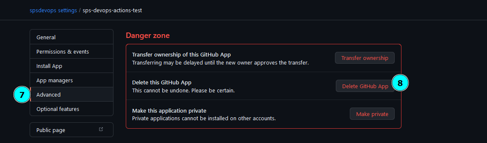

## Desinstalación de GitHub App:
Fuente: https://docs.github.com/en/github-ae@latest/apps/maintaining-github-apps/deleting-a-github-app
Para desinstalar una github app

1) En la esquina superior derecha de cualquier página de GitHub, haz clic en tu foto de perfil.

2) Navegue hasta la configuración de su cuenta.
     2.1) Para una aplicación GitHub propiedad de una cuenta personal, haga clic en Configuración.
     2.2) Para una aplicación GitHub propiedad de una organización:
            2.2.1) Haga clic en Sus organizaciones.
            
            2.2.2) A la derecha de la organización, haga clic en Configuración.
            
            
3) En la barra lateral izquierda, haga clic en "Developer settings". Luego en "GitHub Apps"

Dar clic en el botón "Edit" de la GitHub App a eliminar.

En la barra lateral izquierda, haga clic en Avanzado. y daremos clic en "Delete this GitHub App".

En el cuadro de confirmación, escriba el nombre de la aplicación GitHub para confirmar que desea eliminarla. Haga clic en Entiendo las consecuencias, elimine esta aplicación GitHub.
