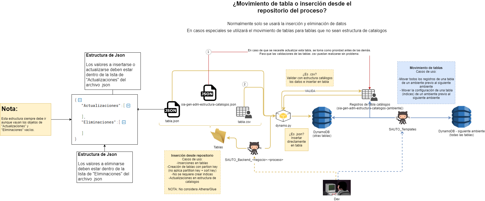

# Inserción y eliminación de datos en Dynamo

_____________________________

El script considera los archivos .json y .csv de la carpeta y la ruta "tablas/" de la raíz del repositorio (no considera archivos en sub-carpetas de la carpeta "tablas").

## Tablas de No catálogos (Archivos .json)(Inserta/elimina):

1. Dentro de la carpeta "tablas/recursos/" se encuentra el archivo plantilla.json.
   Dentro de la lista de "Actualizaciones", se ingresarán los JSONS a insertarse en las tablas (deben ser en formato JSON de DynamoDB) y dentro de la lista de "Eliminaciones" la llave del elemento que se estará eliminando (también debe ser en formato JSON de DynamoDB). Ejemplo:
   
   
   
   ###### Deben ir ambas listas, aunque una vaya vacía (ya sea Actualizaciones o Eliminaciones). Caso contrario provocará error.

   En la carpeta "tablas/ejemplos/" se encuentran ejemplos de ambos.

###### Nota: Los archivos que estén dentro de tablas/ deben ser exactamente el nombre de la tabla sin el sufijo ambiente (-dev, -pre o -prod). El script crea la tabla en caso de que no exista.

2. El script crea la tabla en caso de que no exista y toma el primer elemento del json como "Partition Key" al igual que el "tipo de dato" del elemento.

## Tablas de catálogos (Archivos .csv) (Sólo inserta):

1.Dentro de la carpeta "tablas/ejemplos/" se encuentran algunos ejemplos de llenado.

2.Insertamos los valores que necesitamos insertar o actualizar (por CSV no es posible eliminar valores, se recomienda usar método por archivos JSON).

3.La tabla debe llenarse acorde a como se encuentra su estructura en la tabla de sia-gen-adm-estructura-catalogos-{ambiente}.

**No olvides solicitar la tabla de producción para validar si el usuario realizó cambios en las tablas de producción**

##### Nota importante: En caso de necesitar actualizar la estructura de determinada tabla antes de realizar inserciones. Es posible hacerlo agregando el archivo archivo .json (como el paso de Tablas No catálogos). Si se va a actualizar la tabla de sia-gen-adm-estructura-catalogos-{ambiente} se realiza primero ese paso y posteriormente hace las validaciones e inserciones en la tabla correspondiente utilizando los CSVs.

## ¿Cómo lanzar la inserción/eliminación en el ambiente de...

#### ... Desarrollo?

Para lanzar la ejecución en el ambiente de Develop es necesario empujar los cambios en main, dirigirnos a nuestro repositorio en Github y detener la ejecución.

Posteriormente, lanzar el workflow "push-manual_main",  marcamos la casilla de "Activa la inserción de datos de la carpeta tablas DynamoDB" y ejecutamos el workflow.

#### ... Preproducción y Producción?

Las inserciones se encuentran activadas por defecto. Pero en caso de que no queramos realizar inserciones las podemos desactivar al lanzar el workflow de "manual_pre-release" desmarcando la casilla de "Desmarcar la casilla para desactivar la inserción a DynamoDB".

Diagrama "Overview":

## Escenarios de ejemplo:

#### 1. Estuve haciendo modificaciones en la estructura de mi tabla. Pero entre esos cambios también modifiqué el Partition Key y agregué algunas columnas extra. ¿Cuál camino tomo?

Respuesta: 

En este caso se pueden tomar ambos caminos o solo el movimiento de tablas. Debido a que la tabla necesita se recreada en el ambiente destino (PRE o PROD), se debe realizar un movimiento de tablas, la tabla de estructura puede ser actualizada con el movimiento de tablas o por medio del archivo JSON en el repositorio del proceso. No se podrán usar los archivos CSV pues por ahora estos no tienen la capacidad de modificar el partition key de una tabla existente.

#### 2. Necesito agregarle unas columnas a una tabla de catálogos, pero también agregarles su estructura en la tabla de "sia-gen-adm-estructura-catalogos".

#### ¿Qué hago?

Respuesta:

En este caso es posible hacer la actualización de la tabla de "sia-gen-adm-estructura-catalogos" por medio de un archivo .json (como lo podemos hacer con las demás tablas).

Y al mismo tiempo agregar el archivo .csv con los elementos a insertarse. Aquí se recomienda que descargue previamente el CSV de la tabla y se hagan las ediciones ahí. Ya que en caso de que vaya un espacio en blanco, se actualizará esa celda por un <empty>.

# Rollback de tablas de DynamoDB

---

El workflow de rollback permite restaurar las tablas hacia el punto previo al despliegue. 

Este workflow es posible ejecutarlo en los 3 diferentes ambientes: Develop, Preprod y Prod. 

Para ello en la sección de "Actions" de tu repositorio encontrarás del lado izquierdo el workflow llamado "manual_rollback-dynamodb". Sólo será necesario elegir el ambiente destino y ejecutarlo.

El workflow restaurará el último respaldo que comience con la palabra "despliegue_" (esto debido a que el workflow de inserciones de datos en Dynamo respalda las tablas antes de hacer las inserciones. Y de esta manera evitamos que el workflow restaure otro respaldo más reciente en caso de los respaldos programados.)

Ya se contemplan casos en los que se cuente con tablas globales o no.

Diagrama:

Tiempos promedio por tabla:

Tablas que no cuenten con tablas globales: 5min por tabla

Tablas que cuenten con tablas globales: 7min por tabla

#### Nota importante:

En caso de que el workflow detecte que la tabla no tiene respaldos, por ejemplo cuando es una tabla nueva en el ambiente y fue creada por el propio script. Hay dos opciones:

1.- Crear un respaldo a mano de las tablas nuevas con el nombre: _despliegue_{tabla}_ y ejecutar el workflow de "manual_rollback-dynamodb". Una vez ha terminado de restaurar todas las tablas hay que eliminar eliminar las tablas nuevas (a la que se le generó el respaldo) y el respaldo _despliegue_{tabla}_

2.- No ejecutar "manual_rollback-dynamodb" y restaurar todas las tablas a mano, por ejemplo si la mayoría de tablas en la liberación son nuevas no se ahorra tiempo realizando la opción 1.