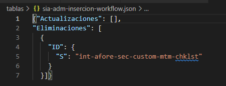
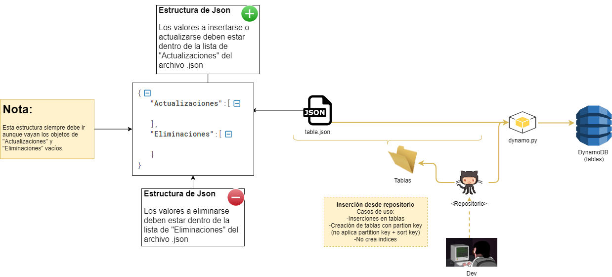
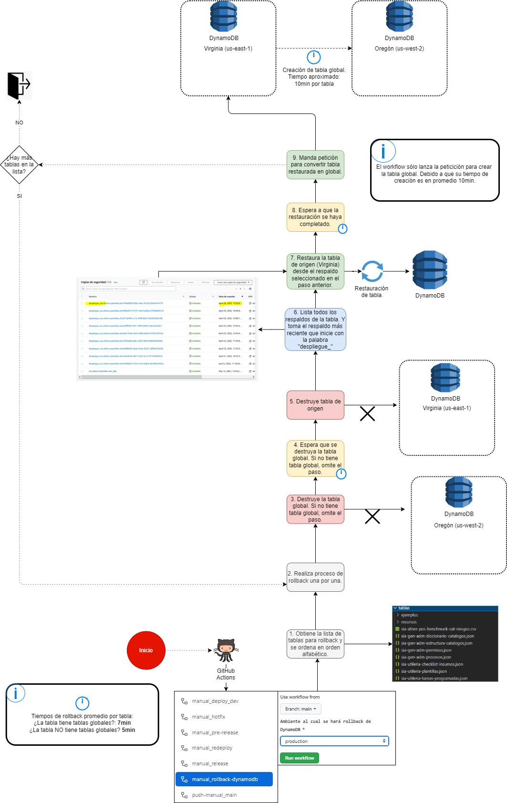

# Inserción y eliminación de datos en Dynamo

_____________________________

El script considera sólo los archivos .json de la carpeta y la ruta "tablas/" de la raíz del repositorio (no considera archivos en sub-carpetas de la carpeta "tablas").

## Tablas (Archivos .json)(Inserta/elimina):

1. Dentro de la carpeta "tablas/recursos/" se encuentra el archivo plantilla.json.
   Dentro de la lista de "Actualizaciones", se ingresarán los JSONS a insertarse en las tablas (deben ser en formato JSON de DynamoDB) y dentro de la lista de "Eliminaciones" la llave del elemento que se estará eliminando (también debe ser en formato JSON de DynamoDB). Ejemplo:
   
   
   
   ###### Deben ir ambas listas, aunque una vaya vacía (ya sea Actualizaciones o Eliminaciones). Caso contrario provocará error.

   En la carpeta "tablas/ejemplos/" se encuentran ejemplos de ambos.

###### Nota: Los archivos que estén dentro de tablas/ deben ser exactamente el nombre de la tabla sin el sufijo ambiente (-dev, -pre o -prod). El script crea la tabla en caso de que no exista.

2. El script crea la tabla en caso de que no exista y toma el primer elemento del json como "Partition Key" al igual que el "tipo de dato" del elemento.

## ¿Cómo lanzar la inserción/eliminación en el ambiente de...

#### ... Desarrollo?

Para lanzar la ejecución en el ambiente de Develop es necesario empujar los cambios en main, dirigirnos a nuestro repositorio en Github y detener la ejecución.

Posteriormente, lanzar el workflow "push-manual_main",  marcamos la casilla de "Activa la inserción de datos de la carpeta tablas DynamoDB" y ejecutamos el workflow.

#### ...  Producción?

Las inserciones se encuentran activadas por defecto. Pero en caso de que no queramos realizar inserciones las podemos desactivar al lanzar el workflow de "manual_pre-release" desmarcando la casilla de "Desmarcar la casilla para desactivar la inserción a DynamoDB".

Diagrama "Overview":

## Escenarios de ejemplo:

# Rollback de tablas de DynamoDB

---

El workflow de rollback permite restaurar las tablas hacia el punto previo al despliegue. 

Este workflow es posible ejecutarlo en todos los ambientes.

Para ello en la sección de "Actions" de tu repositorio encontrarás del lado izquierdo el workflow llamado "manual_rollback-dynamodb". Sólo será necesario elegir el ambiente destino y ejecutarlo.

El workflow restaurará el último respaldo que comience con la palabra "despliegue_" (esto debido a que el workflow de inserciones de datos en Dynamo respalda las tablas antes de hacer las inserciones. Y de esta manera evitamos que el workflow restaure otro respaldo más reciente en caso de los respaldos programados.)

Ya se contemplan casos en los que se cuente con tablas globales o no.

Diagrama:

Tiempos promedio por tabla:

Tablas que no cuenten con tablas globales: 5min por tabla

Tablas que cuenten con tablas globales: 7min por tabla

#### Nota importante:

En caso de que el workflow detecte que la tabla no tiene respaldos, por ejemplo cuando es una tabla nueva en el ambiente y fue creada por el propio script. Hay dos opciones:

1.- Crear un respaldo a mano de las tablas nuevas con el nombre: _despliegue_{tabla}_ y ejecutar el workflow de "manual_rollback-dynamodb". Una vez ha terminado de restaurar todas las tablas hay que eliminar eliminar las tablas nuevas (a la que se le generó el respaldo) y el respaldo _despliegue_{tabla}_

2.- No ejecutar "manual_rollback-dynamodb" y eliminar todas las tablas a mano, por ejemplo si la mayoría de tablas en la liberación son nuevas no se ahorra tiempo realizando la opción 1.